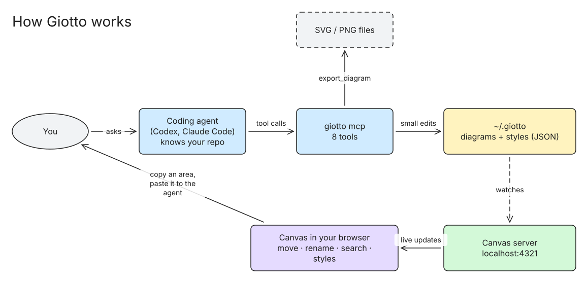
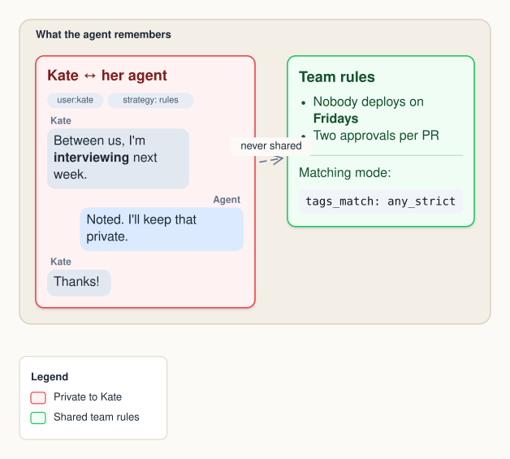

# Giotto

Diagrams your coding agent draws for you, live. The agent (Codex, Claude Code, anything that speaks MCP) already knows your repo; Giotto gives it a canvas. You ask in your chat, the agent draws, and you watch the diagram change in your browser.



*This diagram was drawn by an agent through Giotto and exported with `export_diagram`.*



## What you get

- **Diagrams as files.** Each diagram is a small JSON file in one shared folder, `~/.giotto/`. The agent edits it in small steps (add, update, remove), never by redrawing everything. Nobody can delete a diagram through Giotto.
- **No coordinates needed.** Groups lay out their children in rows, columns or grids and wrap around them; boxes grow to fit their text; notes stay pinned to their shape; arrows pick their sides and route around boxes; a legend explains the colors.
- **Rich boxes.** Titles, bullet lists, tags, chat bubbles, code and dividers, with `**bold**` and `` `code` `` in any text.
- **Feedback for the agent.** Every change reports what was stored and warns about overlaps, text spilling out of a box, and anything that won't be drawn. Exports return the picture, so the agent can check its work.
- **A live canvas** at http://localhost:4321. Every diagram is in the sidebar. It redraws the moment a file changes, and follows the agent when it works on another diagram.
- **Light hand edits.** Drag shapes to move them (they snap to a grid, arrows follow), resize with the corner handle, double-click to rename, ⌘Z to undo. Your edits go back into the same file, so the agent sees them.
- **Point the agent at things.** Drag over an empty part of the canvas: Giotto selects what's inside and copies a short description to your clipboard (diagram, area, each element with its id and position). Paste it in your chat: "make these red", "add a cache here".
- **Search** with ⌘F.
- **Styles, separate from diagrams.** One style is active and it restyles every diagram: background, fonts, colors, lines, corners, shadows, arrowheads, even custom CSS, with an optional dark version. Diagrams say what things are (`tone: "private"`); the style decides their color. Only a default style is built in. Agents make the others, preview them before switching, and can change them; a change shows up on every diagram at once. Pick a style from the gallery and it applies instantly, in light, dark or auto.
- **Export** to SVG, PNG or JSON from the header, or let the agent do it with `export_diagram`.
- **Small and local.** Plain Node, one HTML page, one dependency ([resvg](https://github.com/yisibl/resvg-js), to draw PNGs without a browser). The same drawing code makes the canvas, the SVG and the PNG, so they always match.

## Install

Giotto needs git and Node.js 20 or newer. There's no package to publish or download: it's this repo.

**1. Add the skill** to your agents (Claude Code, Codex, and [others](https://skills.sh)):

```sh
npx skills add nicoloboschi/giotto
```

**2. Ask for a diagram**, like *"draw how requests flow through this repo"*. The first time, the skill tells the agent that Giotto isn't installed yet, and the agent runs the installer for you:

```sh
curl -fsSL https://raw.githubusercontent.com/nicoloboschi/giotto/main/install.sh | bash
```

**3. Restart your agent session** so it loads the Giotto tools, and ask again. The agent gives you a link to the diagram on the canvas at http://localhost:4321.

You can also run the installer yourself first. It:

- clones Giotto into `~/.giotto/app` (or updates it when it's already there)
- adds a `giotto` command in `~/.local/bin`
- connects Claude Code and Codex to the MCP server, and links the skill if it isn't there yet

**Update** with `giotto update` (a `git pull`). The running canvas switches to the new code by itself. `npx skills update` updates the skill.

**Other agents, or by hand:** clone the repo anywhere and point your agent's MCP config at `node /path/to/giotto/bin/giotto.js mcp`.

## MCP tools

| Tool | What it does |
| --- | --- |
| `list_diagrams` | All diagrams, newest first |
| `create_diagram` | A new diagram, optionally with its first elements and a legend |
| `get_diagram` | A diagram's elements, plus the shapes you selected |
| `edit_diagram` | Small changes: `add`, `update` (only the given fields), `remove`, `title`, `legend`; returns what was stored plus warnings |
| `export_diagram` | Write an SVG or PNG file and return the picture; in the active style, a saved one, or an unsaved style to preview |
| `list_styles` | The default style plus all agent-made ones, in full |
| `save_style` | Create a style, or change one by saving it under the same id; warns about fields it ignores |
| `use_style` | Switch the active style, live |

## Good to know

- **Always up to date.** The canvas keeps running in the background after the agent quits. Before every tool call, the MCP server checks the canvas is running the same code. If not, it replaces it, and open tabs reload by themselves. Tabs also check for changes every 3 seconds.
- **Safe with old tabs.** The canvas saves only the fields you changed, merged into the file as it is now, so the agent's newer edits are never lost. A tab running older code can't save at all.
- **Files:** diagrams in `~/.giotto/<id>.json`, agent styles in `~/.giotto/styles/<id>.json`, the active style's id in `~/.giotto/styles/current`. Change the folder with `--dir` or `GIOTTO_DIR`.
- **Ports:** one canvas per port (default 4321, change with `--port` or `GIOTTO_PORT`). Two different folders need two different ports.
- **No browser needed** for exports. Giotto never opens a browser by itself; the agent gives you the link.
- **Canvas only:** `giotto` starts the canvas without an agent and prints its address.

## Develop

```sh
node bin/giotto.js      # canvas
node bin/giotto.js mcp  # MCP server on stdin/stdout
npm test                # logic tests
```

The code is small: `bin/giotto.js` (canvas server + MCP server), `lib/edit.js` (diagram edits, merging, warnings), `lib/render.js` (layout and drawing), `lib/blocks.js` (rich box content), `lib/styles.js` (the default style), `public/index.html` (the canvas page).
